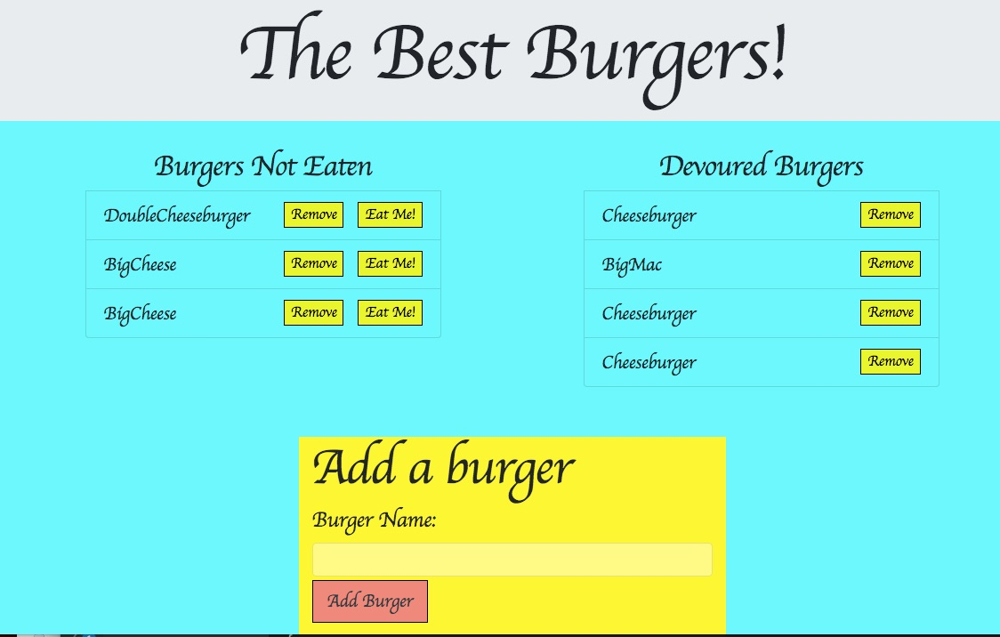

# Burger

### Overview

In this assignment, we created a burger logger with MySQL, Node, Express, Handlebars and a homemade ORM. 

* Eat-Da-Burger! is a restaurant app that lets users input the names of burgers they'd like to eat.

* Whenever a user submits a burger's name,  app will display the burger on the left side of the page -- waiting to be devoured.

* Each burger in the waiting area also has a `Devour it!` button. When the user clicks it, the burger moves to the right side of the page.

